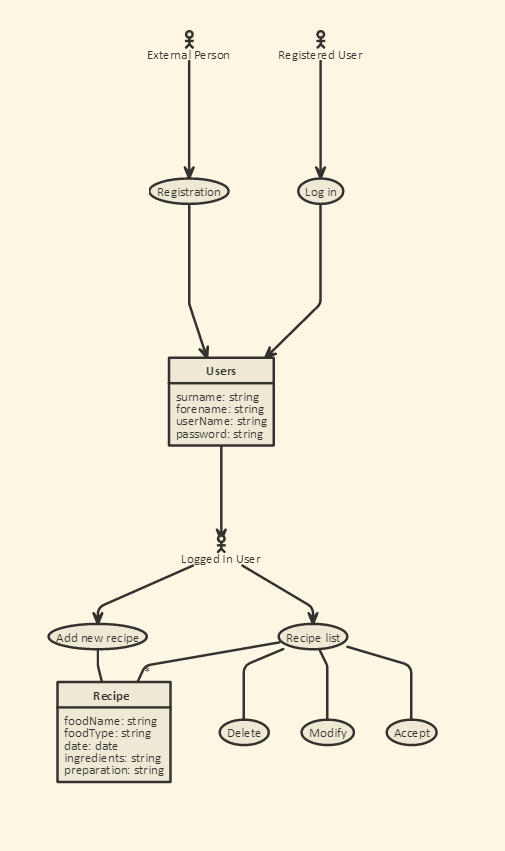
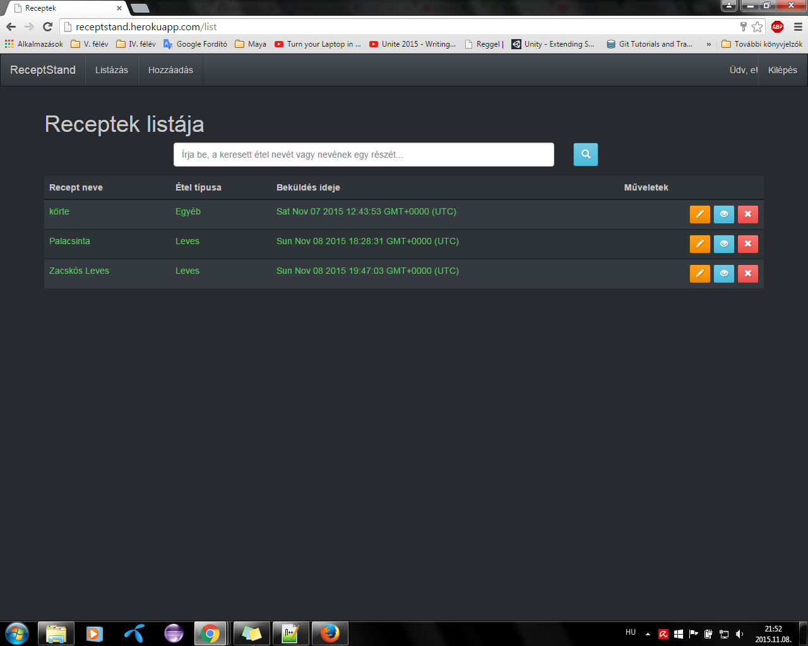
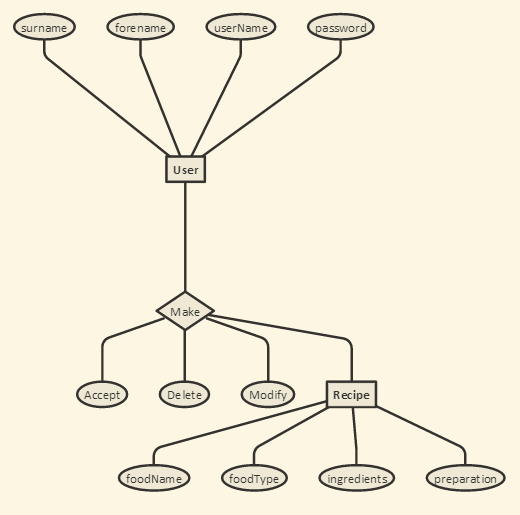
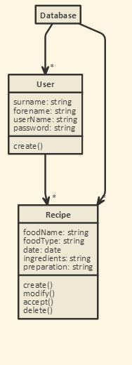

# ReceptStand
Alkfejl beadandó

##Rövid ismertető
Megvalósítandó feladatnak a "Receptek és hozzávalók" nevű példafeladatot választottam.
Amelyet úgy képzeltem el, hogy a regisztrált felhasználók a receptjeiket közös adatbázisban tárolhatják, 
amit a többi felhasználó szintén elér.

## Követelményanalízis

### Funkcionális elvárások
**A programnak tartalmaznia kell:**
- legalább két modellt, egy-sok kapcsolatban
- legalább 1 űrlapot
- legalább 1 listázó oldalt
- legyen lehetőség új felvételére
- legyen lehetőség meglévő szerkesztésére
- legyen lehetőség meglévő törlésére
- legyenek benne csak hitelesítés után elérhető funkciók

### Nem funkcionális elvárások
- perzisztálás fájlba történjen
- közzététel Herokun

### Szerepkörök
- A honlap használatához regisztráció szükséges
- Regisztráció- és belépés után, a felhasználók létrehozhatnak, módosíthatnak és törölhetnek recepteket

Egy recept törlésének pontos menete:
- A felhasználó regisztrál
- Ha sikeres a regisztráció, akkor egyben be is jelentkezett
- A menüsorban a "Hozzáadás"-ra kattintva a felhasználó a "Recept hozzáadása" oldalra kerül
- Itt az étel nevét, hozzávalóit, elkészítési menetét, és az étel típusát megadhatja, majd a hozzáadás gombra kattintva hozzáadhatja
- A "Listázás"-ra kattintva a felhasználó megtekintheti a recepteket
- Itt módosíthatja és törölehti a recepteket a műveletekre kattintva
- A "Kilépés" gombra kattintva kijelentkezhet

## Tervezés

### Architektúra terv
- Oldaltérkép
  - [Kezdőlap](http://receptstand.herokuapp.com/)
  - [Regisztráció](http://receptstand.herokuapp.com/login/signup)
  - [Bejelentkezés](http://receptstand.herokuapp.com/login/login)
  - [Receptek listája](http://receptstand.herokuapp.com/list)
  - [Recept felvétele](http://receptstand.herokuapp.com/add)
- Végpontok
  - /signup
  - /login
  - /logout
  - /list
  - /recipe/{id}
  - /alter/{id}
  - /add

### Felhasználói felület:

### Osztálymodell
- Adatmodell

- Állapotdiagram

## Implementáció

### Fejlesztői környezet:
A program [Cloud 9](https://c9.io/) online fejlesztői környezetben készült, NodeJS-ben.

### Könyvtárstruktúrában lévő mappák
- .tmp : Itt található az disk.db, ami program adatbázisa
- docs/images : Ebben a mappában vannak a dokumentáció képfájljai
- models : Tartalmazza a user és a recipe egyedek modelljeit
- public : Minden oldal által felhasználható forráskódokat tartalmaz
- test : Tesztesetek mapppája
- views/login : A bejelentkezéshez, illetve regisztrációhoz szükséges .hbs fájlokat tarlatmazza
- views/partials : A felület részegységeinek a mappája

## Tesztelés

A tesztesetek a "test" mappában lévő "create.test.js" vannak
Az itt lévő tesztesetek leellenőrzik:
- hogy lehet-e új felhasználót készíteni
- helytelen bemenetre hibát dob
- helyes jelszó működik-e
- helytelen jelszó esetén jelzi-e azt

## Felhasználói dokumentáció

### Ajánlott hardver-, szoftver konfiguráció

A weboldal használatához egy böngészővel rendelkező számítógép ajánlott, általános teljesítménnyel.

### Telepítés lépései

Nem igényel telepítést. A receptstand.herokuapp.com címen megtalálható.

### Program használata

A weboldalon használat során a következőkkel találkozhat a felhasználó:

#### Menü
A menüsor az oldal tetején található. Tartalma:
- Az oldal címe (Recept stand)
- Listázó gomb, amivel listázni tudja a bejelentkezett felhasználó a recepteket (listázás)
- Hozzáadás gomb, amivel új receptet tud felvenni a bejelentkezett felhasználó (hozzáadás)
- Bejelentkezés gomb, ha még nincs a felhasználó bejelentkezve (bejelentkezés)
- Felhasználót üdvözlő szöveg ("Üdv, [név]!")
- Kilépés gomb, amivel ki lehet lépni (kilépés)

#### Regisztráció
Ezen a felületen regisztrálhatnak az új felhasználók.
A regisztrációhoz szükség van az alábbi adatokra:
- Vezetéknév
- Keresztnév
- Felhasználó név
- Jelszó

Kitöltés után a "Submit" gombra kattintva regisztrál a felhasználó, vagy a "Cancel" gombbal törölhetőek a beírt adatok.
A regisztráció csak helyes adatok esetén történik meg, ki nem töltött mező esetén hibát jelez az oldal.

#### Bejelentkezés
A már regisztrált felhasználók itt jelentkezhetnek be felhasználó név, és jelszó párossal a submit gombra kattintva.
Cancel gombbal lehet törölni a begépelt adatokat.

#### Listázás
Bejelentkezés után itt láthatóak a receptek.
A receptek alábbi adatai láthatóak:
- Étel neve
- Étel típusa
- Beküldésének ideje
- Műveletek

A receptek felett egy kereső mező található, ahol az étel nevére, vagy nevének egy töredékére lehet keresni.
A listázott elemek táblázatban vannak felsorolva.

A következő műveletek elérhetőek a felhasználók számára:
- A narancssárga hátterű ceruza ikonra kattintva az adott receptet lehet módosítani.
- A kék hátterű szem ikonra kattintva a felhasználó megtekintheti az adott sorban levő receptről az összes adatot egy felugró ablakban.
- A piros hátterű x gombra kattintva törölheti a felhasználó az adott sorban levő elemet.

#### Hozzáadás
Bejelentkezés után itt tudunk új recepteket felvenni.
Kötelezően kitöltendő adatok:
- Étel neve
- Hozzávalók
- Elkészítés
- Étel típusa

A hozzáadás gombra kattintva hozzáadhatjuk a receptet a többihez. A Mégse gombra kattintva törölhetjük a kitöltött mezők adatait.

